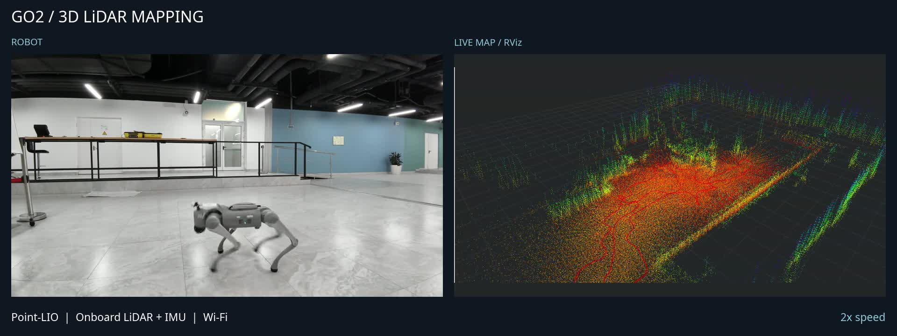

# Demo recordings

## 3D Point-LIO mapping — September 16, 2026

The featured README video combines an external camera with the RViz screen
recording from the same session: robot motion, live 3D mapping, and a final map
overview. Point-LIO runs on the onboard Jetson with the built-in LiDAR and IMU;
RViz runs on the laptop over Wi-Fi.

The edit starts at 01:06 in the external recording and 00:12 in the screen
recording. The approximate 54-second offset follows the recording start times
and was checked visually against motion. Playback is 2×, with a short final
hold. The export is 42 seconds, 1920 × 720, H.264 MP4, without audio.

The video demonstrates mapping. It is not an autonomous-navigation test or a
measurement of map accuracy. This Point-LIO configuration has no loop closure.

[3D implementation and setup](https://github.com/dancher00/go2-nav2-wifi/tree/experiment/lidar-3d-slam)
· [Baseline and limitations](https://github.com/dancher00/go2-nav2-wifi/blob/experiment/lidar-3d-slam/docs/POINTLIO-BASELINE.md)

## Earlier 2D demos

These recordings demonstrate the 2D SLAM + Nav2 workflow on `main`.

### Navigation A → B

https://github.com/user-attachments/assets/44ae54a9-09f1-490c-ab3b-6291595e3324

### LiDAR + RViz

https://github.com/user-attachments/assets/2c817478-9fc5-4000-8211-b8b47e07eafb

### SLAM mapping

https://github.com/user-attachments/assets/16ffa9da-6469-4384-a56e-00d0343bb375
