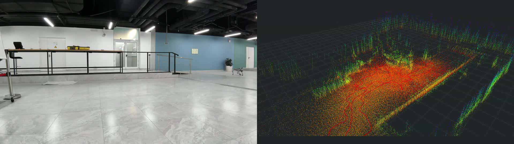

# Demo recordings

## 3D Point-LIO mapping — September 16, 2026

The external camera and RViz recording show the same session. The edit starts
at 01:06 in the external recording and 00:12 in the screen recording. The
54-second offset follows the recording filenames and was visually checked
against motion; it is approximate, not frame-accurate hardware synchronization.
Both views play at 2× speed. The opening includes SLAM initialization. After
36 seconds, the edit switches to a larger RViz view, followed by a short hold.
Desktop chrome and terminal setup are cropped or omitted. No audio is included.

This is a mapping demonstration. Walking and a visible trajectory do not by
themselves demonstrate autonomous navigation, loop closure, or measured accuracy.

Rebuild locally with `bash demo3d/render-demo.sh` (FFmpeg required). The original
recordings are local files in `demo3d/`; they are not needed to watch the export.
The script refuses to overwrite an existing export.

The video is published as a GitHub attachment and embedded in the README.
The local export is `docs/media/go2-3d-slam-demo.mp4`.

## Earlier 2D demos

These demonstrate the previous 2D workflow and are retained for reference.

### Nav A → B

https://github.com/user-attachments/assets/44ae54a9-09f1-490c-ab3b-6291595e3324

### LiDAR + RViz

https://github.com/user-attachments/assets/2c817478-9fc5-4000-8211-b8b47e07eafb

### SLAM mapping

https://github.com/user-attachments/assets/16ffa9da-6469-4384-a56e-00d0343bb375
