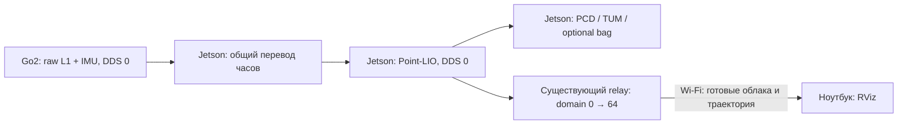

# 3D LiDAR по Wi-Fi: экспериментальный baseline

[Проверенное online-планирование Nav2 без движения](LIDAR-3D-NAV2.md):
`./mapping.sh --3d --plan`. Автономное движение ещё не подключено.

**Последний live-тест Point-LIO на Jetson, 2026-09-09 17:52 UTC:**
контрольный проход 222.85 с, 3427 поз, 2 160 459 точек. После выполнения
пользователем прохода с возвратом невязка 3.00 см по LiDAR IMU и 3.18 см
по корпусу с текущими extrinsics. Сравнены медианы 0–8 и 200–220 с;
при конечном окне 170–220 с невязка корпуса 3.01 см. Конечная разность
Z корпуса +1.58 см. Максимальное отклонение от конечной медианы 4.44 см.
Это один live-результат, не гарантия сантиметровой точности всей карты.
Утолщения стен и фрагменты остаются; loop closure отсутствует.
Запуск сохраняется: `GO2_RECORD=1 ./mapping.sh --3d`.
[Измерения](measurements/pointlio-live-return-2026-09-09.json),
[траектория](measurements/pointlio-live-return-2026-09-09.png),
[карта](measurements/pointlio-live-map-2026-09-09.png).
Сессия завершена; результат и сенсорная запись сохранены на ноутбуке.

Ветка `experiment/lidar-3d-slam` создана от проверенного `main`
`4bab4ab38c64a84a0e3a6a9b7b09b3ec310d8317`. `main` сохраняет 2D
slam_toolbox + Nav2. D435i и её зависимости в этот эксперимент не входят.

**Исправлены две причины искажения карты:** несогласованные оси при первом
повороте и неверный режим модели IMU при последующей ходьбе. Текущий вариант:
`extrinsic_R=I`, `use_imu_as_input=false`, ускорения выключены внутри backend.
Режим `false` соответствует переопределению в launch CMU, которое первоначально
было пропущено при чтении YAML.

На полной записи прохода 211.88 с повтор дал 3261 позу и 1746064 точки.
После возвращения оценка находится примерно в 0.8 м от начала вместо 7 м;
несогласованность пола начала/конца — 0.29° вместо 5.20°. Стены в сохранённой
карте стали согласованнее. Остаточный дрейф есть; эти числа **не** являются
абсолютной точностью относительно ground truth. Первый короткий live-проход текущего режима сохранён 9 сентября;
длинные маршруты и независимая оценка точности ещё нужны. Никаких guards или автоматических сбросов не добавлено.

Здесь используется **Point-LIO**, ROS2-адаптация CMU, commit
`43d5f54b389b251713f0097893c30fa76c870d54`. Это независимая оценка движения по
сырым точкам L1 и гироскопу, **локальная 3D-одометрия без loop closure**.
Это gyro-assisted LiDAR odometry, **не полная LIO с ускорениями**.
Заводская одометрия нужна существующему переводчику часов только как поток
опорных timestamps: её pose не передаётся в Point-LIO и не публикуется в TF.

## Leg-KILO: отдельный вариант с кинематикой ног

**Сравнение с существующим Point-LIO на записях, 2026-09-09:** профиль
`./mapping.sh --3d` без изменения параметров прошёл круг и уклон в replay 2×.
Невязка круга 0.0345 м по LiDAR IMU, 0.0247 м после пересчёта к корпусу;
на уклоне расстояние между концами 0.197 / 0.182 м соответственно.
Пересчёт использует текущие extrinsics, не новую независимую калибровку.
Разность конечного Z корпуса около +0.020 м в обоих случаях, оценённый
спуск на уклоне около 0.50 м; истинная высота уклона неизвестна.
Это offline-проверка, не новый live-результат и не доказательство общей
точности карты. Утолщения/разрывы стен остаются. Point-LIO выбран кандидатом
для следующего live-теста; Leg-KILO остаётся отдельным вариантом.
[Измерения](measurements/cmu-baseline-2026-09-09.json),
[траектории](measurements/cmu-baseline-2026-09-09.png),
[срезы карт](measurements/cmu-baseline-maps-2026-09-09.png).

В записи первого круга у 7151 из 46607 SportState нет LowState с тем же IMU
во всей записи (15.34%). Внутри replay эти пакеты обрабатываются без
наблюдений ног. Независимые подписки recorder/backend не гарантируют
одинаковые принятые live/replay-входы. Это установленное ограничение записи,
а не доказанная единственная причина live-дрейфа.
[Проверка покрытия пар](measurements/legkilo-recording-pair-coverage-2026-09-09.json).

Поправка экспорта пустой последней под-карты подготовлена и собрана для
amd64: на проблемном replay сохранены все 2439 native-поз вместо 1370;
на записи уклона все 2750 поз сохранены без значимого изменения координат.
На Jetson эта поправка ещё не установлена.
[Проверка экспорта](measurements/legkilo-export-tail-fix-2026-09-09.json).
[Повторная проверка CMU по исходникам](measurements/cmu-comparison-2026-09-09.md):
у них LiDAR-гироскоп с собственной калибровкой, без ног; ускорение на входе
Point-LIO обнулено, SLAM pose graph отсутствует.

**Разбор петель на двух live-записях, 2026-09-09:** на неизменных
сохранённых позах/связях восстановлен граф. Без петель / текущие веса /
усиление веса перемещения петли в 100 раз: круг 1.028 / 1.012 / 0.992 м;
уклон 0.767 / 0.985 / 0.937 м между концами. Текущая цель оптимизации
воспроизведена с расхождением итоговой дистанции менее 0.04 мм.
Петли у старта первого круга предлагают лишь 1–4 см поправки.
81–86% выбранных плоских соответствий у возврата — горизонтальные поверхности;
геометрически слабое направление почти совпадает с направлением невязки.
Усиление веса не восстанавливает отсутствующую информацию о возврате.
Параметры продукта не менялись; следующий эксперимент — контекст под-карт
и начальное совмещение существующего loop backend.

Raw replay не принят за чистое сравнение с live: два повтора первого круга
дали 0.0333 м по native frontend против 1.0279 м в live. Это не доказательство
точности 3 см: реально принятая последовательность live-входов не была
записана в диагностический trace. На уклоне frontend replay тоже отличается.
Дополнительно найден дефект экспорта: 1069 поз покоя с пустой текущей
под-картой пропущены в backend TUM, хотя присутствуют в native CSV;
это не потеря 70 секунд обработки сенсоров. Исправление пока не внесено.
Выводы о весах выше получены на **фиксированных live-позах и связях**.
[Метод, результаты и ограничения](measurements/legkilo-loop-diagnosis-2026-09-09.json),
[сравнение](measurements/legkilo-loop-diagnosis-2026-09-09.png).

**Проход по уклону, 2026-09-09 17:12 UTC:** SLAM оценил спуск до
−0.422 м относительно старта, затем подъём; итоговая разность Z +0.011 м.
Фактическая высота уклона не измерена. Расстояние между конечными XY:
frontend 0.766 м, backend 0.985 м после семи принятых петель. Совпадение
физических конечных точек этой записи отдельно не подтверждено, поэтому
это пока расстояние, а не доказанная ошибка возврата. В покое максимальное
отклонение от медианы 1.75 см. Заводской Z меняется лишь примерно на 0.06 м
и не служит эталоном высоты уклона. Запись выгружена с проверкой SHA256 и
удалена с Jetson. [Измерения](measurements/legkilo-slope-2026-09-09.json),
[график](measurements/legkilo-slope-2026-09-09.png).

**Последний live-круг, 2026-09-09 17:05 UTC:** пользователь подтвердил
возврат в исходную точку. Невязка backend **1.012 м**, frontend 1.028 м;
приняты восемь петель, но ошибка возврата почти не уменьшилась. После
возврата максимальное отклонение от медианы за 100–150 с — 1.70 см.
Таким образом, предыдущие 21 см в replay не подтвердились на новом проходе.
Сессия штатно завершена, карта, траектория и запись находятся на ноутбуке.
[Измерения](measurements/legkilo-live-circle-2026-09-09.json),
[траектория и карта](measurements/legkilo-live-circle-2026-09-09.png).
Следующая диагностика — накопление ошибки при движении и слабая коррекция
замыканием петли на этой записи; новые проходы пока не нужны.

**Актуально, 2026-09-09: исправлена сборка входов IMU/ног.** Повторные
SportState могли терять уже использованный LowState либо получать другой
вариант энкодеров с тем же IMU. Задержанный LowState в записи переполнял
короткую очередь; вместе с кинематикой терялись инерциальные измерения.
Исправлены существующий кеш и очередь; при отсутствии энкодеров сохраняется
body IMU без наблюдения скорости ног. Новых узлов/guards нет, параметры SLAM
в этой поправке не менялись (`kin_meas_noise=0.5`).

На коротком круге все 1913 входных кадра и сохранённые позы совпали при
replay 1×/2×; невязка этого круга 0.86 м. На длинной записи невязка второго
круга с подтверждённым возвратом уменьшилась с **1.189 до 0.210 м**.
Это replay, не новый live-проход и не оценка точности всей карты.
Проблемный начальный фрагмент длинной записи также совпал по 906 кадрам
при 1×/2×. Полный длинный replay 1× ещё не повторён. Последние шесть кадров
(~0.39 с покоя) не обработаны из-за оставшихся к концу записи пар в очереди.

Финальный код установлен на Jetson. Проверка без команд движения: 197.5 с,
3038 поз, максимальное смещение от первой позы 1.78 см. Результат выгружен
на ноутбук с проверкой SHA256 и удалён с Jetson; процессы остановлены.
Следующий шаг — контрольный проход на установленной сборке:
`GO2_RECORD=1 ./mapping.sh --3d --legkilo`, остановка Ctrl+C.
[Измерения, идентификаторы сборок и ограничения](measurements/legkilo-input-pairing-2026-09-09.json).

**История настройки до исправления входов:**

**Поправка после предыдущего контрольного круга:** `kin_meas_noise=0.5` вместо
0.05. Прежняя настройка слишком сильно доверяла скорости от опорных ног:
на круге с подтверждённым возвратом исходная горизонтальная невязка 1.59 м;
при 0.5 — 0.73 м в replay 1x и 0.039 м при 2x, без принятых петель.
Тогда наблюдался разброс повторов; **точность 4 см не заявляется**. На отдельной записи
разброс того же участка стены снизился с 0.34 до 0.19 м. NDT и остальные
настройки сохранены. Изменён один параметр, YAML установлен на Jetson;
новых узлов/guards нет. Следующий live-проход на этой настройке ещё нужен.
[Причина, сравнение семи прогонов и ограничения](measurements/legkilo-kin-weight-diagnosis-2026-09-09.json),
[сравнение траекторий](measurements/legkilo-kin-weight-diagnosis-2026-09-09.png).

Ниже — история предыдущих проверок; значения относятся к указанным записям.

**Сильный стартовый уход лёжа уменьшен отключением второго обновления облака**
(`two_step_lidar_eskf=false`); C++ backend оставлен без новых изменений.
На одинаковой записи 72.4 с максимальное смещение снизилось с 3.146 м до
0.0947 м; на отдельной стойке 62 с — с 1.04 см до 0.35 см.
На проходе 199.4 с шаг поз p95 изменился с 5.34 до 4.98 см, наклон пола
(медиана) с 0.58° до 0.68°, расстояние между концом и началом с 0.93 до 1.47 м.
Конец прохода не был размечен, улучшение точности ходьбы не заявляется.
Это обход проблемного режима обновления по L1, не доказанное исправление
всех причин дрейфа. Начинать следует неподвижно. Guards и сбросов карты нет.
[Сравнение вариантов](measurements/legkilo-single-step-2026-09-09.json).
Живой sensor-only запуск нового режима на Jetson: робот лёжа, `contacts=0`,
1165 поз за 75.7 с, максимальное смещение **11.85 см**. Остаточный дрейф
сохраняется. Сессия остановлена, 18 файлов проверены SHA256 и перенесены
на ноутбук; копия с Jetson удалена. Переход лёжа → стойка → ходьба
с новым режимом пока не проверен.


Экспериментальный запуск: `./mapping.sh --3d --legkilo` после установки
`GO2_ROBOT_IP=192.168.8.245 ./setup-lidar3d.sh --legkilo`. Вычисления — на Jetson,
RViz и модель робота — на ноутбуке. Обычный `./mapping.sh --3d` сохраняет Point-LIO.

Внутри Leg-KILO используются сырой L1, body IMU и кинематика ног из реальных
энкодеров и датчиков силы `LowState`. Timestamp берётся из `SportModeState`
с **тем же шестикомпонентным IMU-измерением**; перевод часов общий с LiDAR.
Заводская мировая одометрия в оценку движения не подмешивается. Сопоставление
и FK встроены в C++ backend, новых узлов управления/guards нет.

Loop closure включён в upstream backend. Текущая публикация карты/траектории
в RViz и сохранённые `export/global_map/global_map.pcd` и
`export/trajectories/backend_imu_tum.txt` учитывают принятые backend-коррекции.
Это ещё не означает, что замыкание петли сработало на конкретном проходе.
Контактные пороги 35/25 предварительные. Без размеченного прохода нельзя
утверждать улучшение точности или уменьшение дрожания при ходьбе.
[Адаптация, источники и ограничения](LIDAR-3D-FUSION-OPTIONS.md).

Установка и live sensor-only запуск на Jetson проверены 9 сентября. За 62 с
с нагруженными стопами максимальное отклонение составило 2.2 см; Point-LIO
на той же записи — 2.8 см, Leg-KILO без encoder-адаптации/контактов — 5.5 см.
Это устойчивость в стойке, не точность траектории при ходьбе; повторы выполнялись
на ноутбуке, исходный запуск с ногами — на Jetson. Без контактов на записи лёжа
Leg-KILO с прежним двухэтапным обновлением дал 2.35 м; результат нового режима описан выше.
Автоматического ожидания стойки или сброса карты нет.

На Jetson backend занял ~35% одного ядра и 58 MiB RSS; одометрия 15.4 Гц,
на ноутбуке облака ~4 Гц (3.02 Mbit/s CDR), траектория ~1 Гц. Это короткое
измерение, не нагрузочный тест. Закрытие сессии/выгрузка PCD и TUM проверены.
[Измерения и ограничения](measurements/legkilo-baseline-2026-09-09.json).


Проход 199.4 с сохранён на ноутбук; 30 файлов (636 MB) проверены SHA256,
копия с Jetson удалена. На повторе этой записи `kin_meas_noise` уменьшен
с 0.5 до **0.05** (диагональ ковариации измерения скорости ног).
95-й процентиль расстояния между соседними позами снизился с 6.34 до 5.34 см;
медианный наклон пола — с 1.04° до 0.58°. Шаг поз включает реальное движение,
поэтому это не отдельное измерение дрожания. На независимой записи стойки
максимальное смещение уменьшилось с 2.21 до 1.04 см за 62 с.
Тогда настройка 0.05 была выбрана для следующего live-запуска; повторы выполнялись
на ноутбуке при 2x. Последующий круг выявил большую невязку, поэтому выше описан
возврат к 0.5 после новых сравнений.
Пользователь остановился примерно рядом с началом: расстояние конечной позы
до начальной (~1 м) нельзя считать ошибкой возврата. Принятых loop closure
в этом коротком проходе не было. NDT оставлен включённым.
[Сравнение и ограничения](measurements/legkilo-walk-2026-09-09.json).


### Постоянная карта Leg-KILO в RViz

В режиме `--legkilo` `/lidar3d/registered` теперь содержит полную версию карты
backend, примерно раз в секунду. Она собирается из завершённых участков с
оптимизированными позами и текущего участка. RViz заменяет предыдущую версию
(`legkilo.rviz`, Decay Time 0), поэтому старые области не исчезают через 120 с
и не остаются на старом месте после loop closure. Обычный Point-LIO сохраняет
свой отдельный профиль RViz с недавними сканами.

`/lidar3d/path` содержит заново пересчитанную историю поз; к текущей
`/lidar3d/odom` и модели Go2 применяется последняя коррекция backend.
Частота текущей позы остаётся частотой LiDAR, около 15 Гц. Оцениватель frontend
от этого не меняется: это согласование выходов с уже существующим backend.
Все операции выполняются внутри существующего процесса Leg-KILO, через
существующие topics/relay и управление сессиями. Новых ROS-узлов/guards нет.

Карта готовится в worker backend, ROS получает неизменяемый снимок. Чтение
PCD и сборка полной геометрии выполняются при изменении карты, не на каждом
LiDAR-кадре; между изменениями повторно используется готовое облако.
Стоимость пересылки полной карты растёт с её размером. Коррекции в RViz имеют
задержку обновления порядка секунды; это не измеренная end-to-end задержка Wi-Fi.

Проверено 9 сентября: повтор записи 199 с, 3063 позы. Последняя опубликованная
карта (48 505 точек) совпала с сохранённой PCD до float-точности; вся опубликованная
траектория совпала с backend TUM. Начальный участок сохранился после 199 с.
Полная карта передаётся как XYZI, 16 байт/точку: в отдельном коротком тесте
через Wi-Fi пришли 15/15 карт по 48 198 точек, одинаковые CRC, примерно
6.17 Мбит/с CDR при 1 Гц (без сетевых накладных расходов). Это проверка транспорта,
не точности SLAM; истинная end-to-end задержка здесь не измерена.

Сборка установлена на Jetson и проверена с лежащим роботом: RViz Global Status OK,
модель Go2 видна; backend ~18% одного ядра / 45 MiB RAM в 30-секундном окне.
За 53 с неподвижная оценка сместилась максимум на 10.6 см — дрейф остаётся.
Результат сохранён на ноутбук с SHA256-проверкой, копия результата на Jetson удалена,
проверочная сессия остановлена. Новый проход на окончательной сборке ещё нужен.
107 Python-тестов прошли; C++ собран для amd64/arm64 и проверен replay/live.
[Измерения, метод и ограничения](measurements/legkilo-backend-map-2026-09-09.json).

### Расслоение стен при ходьбе

Проход `run-20260909-142549-1370vot1` (199 с) имел расслоение и в сохранённой
PCD, а не только в RViz. LoopClosure добавлял `ROOT_DIR/result/` к абсолютному
каталогу результата и не мог загрузить PCD участков; путь исправлен.
Для коротких маршрутов `loop_min_id_separation=3`, максимум расстояния
соответствия 0.3 м, расстояние inlier 0.15 м, минимум доли совпавших точек 0.7.
Порог `loop_icp_fitness_threshold` — доля точек, а не среднеквадратичная ошибка.

После исправления пути и коротких петель разброс выбранного участка стены
по нормали (p95−p5) уменьшился с 0.52 до 0.40 м. Уменьшение размера участка
с 20 до 5 ключевых кадров дало 0.34 м. Двойные поверхности полностью не устранены;
показатель включает реальную структуру поверхности и шум, абсолютная точность
не измерена. На другом проходе наклон пола остался сопоставимым.
[Исходное сравнение](measurements/legkilo-double-walls-2026-09-09.json).

### Контрольный круг с возвратом в исходное место

Новый live-проход `run-20260909-151627-bjedi0db` на окончательной сборке:
пользователь подтвердил возврат точно в исходное место. Сравниваются медианы
первых 2 с и неподвижного стояния на 65–85 с; последующее укладывание исключено.
Горизонтальная невязка frontend 1.65 м, после backend 1.59 м. Из 91 проверки
приняты две промежуточные петли (2→8 и 3→6); петля к стартовому участку не принята.
Заводская позиция, записанная только для диагностики, имеет невязку 0.50 м;
это не ground truth и не вход слияния в текущем backend.

Ошибка присутствует в сохранённой оценке Jetson до Wi-Fi/RViz. Пол по независимой
эвристической аппроксимации сырых кадров имеет наклон median/p95 1.64°/3.47°;
угол вида камеры RViz нельзя принимать за наклон карты. Последующее снижение
высоты корпуса на 0.27 м совпадает с укладыванием и не включено в невязку возврата.
Качество ходьбы пока неприемлемо для точной карты. Запись 1913 кадров / 124.59 с
сохранена на ноутбук для дальнейшей offline-диагностики, результат удалён с Jetson
после штатного переноса. Рабочие настройки по одному неудачному кругу не изменялись.
[Числа и метод](measurements/legkilo-circle-return-2026-09-09.json),
[карта и траектории](measurements/legkilo-circle-return-2026-09-09.png).

## Основной режим: вычисления на Jetson

По решению пользователя 9 сентября основной 3D-сценарий перенесён на Jetson.
`./mapping.sh --3d` запускает Point-LIO и общие часы в отдельном ARM-контейнере
`go2-lidar3d-onboard`, RViz — в существующем контейнере ноутбука.
Предыдущий сценарий сохранён: `./mapping.sh --3d --laptop`. 2D не меняется.



В проверенном устройстве Orin Nano Developer Kit: ARM64, RAM 8 ГБ (OS видит
7.2 GiB), Ubuntu 20.04 / L4T R35.3.1; внутри экспериментального Docker —
Humble. Backend использует CPU; CUDA/TensorRT для него не подключены.
Эксперимент установлен в `~/go2-nav2-lidar3d-onboard`, основной репозиторий
робота `~/go2-nav2-wifi` и заводская ROS/DDS-конфигурация не меняются.

Однократная установка с ноутбука (на Jetson уже нужен базовый ARM-образ
`go2-humble:local`; установленная Foxy остаётся на хосте):

```bash
GO2_HOST_IP=192.168.8.214 GO2_ROBOT_IP=192.168.8.245 ./setup-lidar3d.sh --laptop
GO2_ROBOT_IP=192.168.8.245 ./setup-lidar3d.sh
```

Запуск с ноутбука, IP берутся из окружения существующего контейнера:

```bash
./mapping.sh --3d
```

С записью диагностики: `GO2_RECORD=1 ./mapping.sh --3d`. Без окна: `GO2_RVIZ=0 ./mapping.sh --3d`.
Закрытие RViz / Ctrl+C отправляет owner-scoped stop на Jetson и закрывает только
свою локальную сессию. Карта, траектория, часы и optional bag временно сохраняются на Jetson.
После остановки `mapping.sh` переносит весь результат в локальный
`ws/maps/lidar3d/run-*`, проверяет SHA256 каждого файла и только затем удаляет
копию с Jetson. При ошибке передачи исходные файлы остаются на Jetson.
Запись bag по умолчанию выключена (`GO2_RECORD=0`). Для остановки
непосредственно на Jetson: `docker exec go2-lidar3d-onboard bash /ws/scripts/go2-session.sh stop lidar3d`.
Если связь оборвалась, удалённый stop может не дойти: вычисления остаются на
Jetson, а остановку нужно повторить после восстановления связи. Автоматического
управления движением/новых guards в этой цепочке нет.

Профиль существующего relay `lidar3d-map` передаёт только `/lidar3d/registered`,
`/lidar3d/odom`, `/lidar3d/path`, best-effort. Облака для отображения ограничены
максимум 5 Гц, полный Path — 1 Гц; backend и сохранение карты работают на полной
частоте локально. При пропуске отдельных кадров отображение может быть менее
плотным, чем сохранённая PCD-карта. Сырые cloud/IMU на ноутбук не передаются.
Wi-Fi больше не находится между измерениями и backend; это отдельный onboard
сценарий, а прежние измерения транспортного Wi-Fi SLAM ниже относятся к ноутбуку.
Новый алгоритм SLAM или научная новизна этим переносом не заявляются.
Nav2 в 3D-сценарий пока не включён.

### Проверено на Jetson 9 сентября

Установка `GO2_ROBOT_IP=192.168.8.245 ./setup-lidar3d.sh` выполнена целиком:
отдельный ARM-образ, контейнер и пакет. `./mapping.sh --3d` запустил локальные
raw clock/Point-LIO на Jetson и только RViz на ноутбуке. Первая сессия
`run-20260909-113211-kukb7xvu` сохранила **657509 точек / 1987 поз за 129.17 с**.
Остановка локальной сессии `lidar3d-viz` вызвала удалённый owner-scoped stop,
завершила только её процессы и сохранила PCD/TUM/bag. После этого Jetson
вернул `not-managed`. Первые 79 с: max смещение 1.7 см; позже в записи есть
изменение высоты, поэтому max всей сессии не является дрейфом в покое.

Запись предыдущего короткого прохода повторена на Jetson при rate=1:
`run-20260909-113524-_xmjw_0d`, **2434 позы за 158.21 с**, все timestamps
совпали с ноутбучным результатом. Максимальное различие позиций 4.14 см,
конечное 0.97 мм, максимальное различие ориентаций 1.18°. Это сравнение
двух обработок одного входа, не точность относительно ground truth.

Финальный live-запуск после оптимизации relay:
`run-20260909-113920-3yygoyla`. 30-секундное измерение ресурсов **без DDS-observers**:

| Процесс на Jetson | CPU, % одного ядра | Peak RSS |
|---|---:|---:|
| Point-LIO | 46.4% | 164.9 MiB |
| Общие часы + запись | 55.6% | 59.2 MiB |
| Relay subscriber | 5.1% | 52.0 MiB |
| Relay publisher | 7.2% | 51.0 MiB |

Jetson WLAN TX всех приложений: **0.91 Мбит/с** в этом окне. Старые около
19 Мбит/с относятся к передаче raw данных в ноутбучном сценарии; это разные
прогоны, не строго парный benchmark. Для visualization-профиля subscriber
получает raw CDR, отбрасывает лишние кадры до десериализации и передаёт
оставшиеся байты без изменения. Это устраняет распаковку растущего Path
на полной частоте. В ноутбучном resource-окне из процессов цепочки был
только RViz, около 100% одного ядра / 218 MiB; это software rendering.

99 регрессионных тестов прошли. Результаты и ограничения:
[measurements/lidar3d-jetson-2026-09-09.json](measurements/lidar3d-jetson-2026-09-09.json).

## Сохранённый режим вычислений на ноутбуке: установка и запуск

Нужен собранный базовый образ проекта `go2-humble:local`, Docker Compose,
SSH-доступ к роботу и графический сеанс ноутбука. Адреса ниже повторно проверены
8 сентября 2026: робот `192.168.8.245`, ноутбук `192.168.8.214` (`wlp2s0`).
Адреса могут измениться после переподключения Wi-Fi.

Однократная установка отдельного образа и контейнера:

```bash
GO2_ROBOT_IP=192.168.8.245 GO2_HOST_IP=192.168.8.214 ./setup-lidar3d.sh --laptop
```

Запуск с RViz:

```bash
./mapping.sh --3d --laptop
```

Закрытие RViz или Ctrl+C останавливает принадлежащие этой сессии процессы и
сохраняет результат. Без окна: `GO2_RVIZ=0 ./mapping.sh --3d --laptop`.
Управляемая остановка: `docker exec go2-lidar3d bash /ws/scripts/go2-session.sh stop lidar3d`.
Статус: та же команда с `status lidar3d`.

Для разбора срыва при повороте включается запись **измерений**, без нового
ROS-узла или дополнительных подписчиков:

```bash
GO2_RECORD=1 ./mapping.sh --3d --laptop
```

Существующий переводчик времени пишет принятые входы backend в `sensors/`
(rosbag2 SQLite): сырые координаты точек, per-point time и значения IMU не
меняются; headers уже переведены общим фиксированным offset. Исходные stamps
остаются в `sensor-clock.jsonl`. В bag также сохранена заводская одометрия
для сравнения, но Point-LIO её не использует. Bag timestamp — время callback
ноутбука после публикации, **не** истинная acquisition/E2E latency. Запись на
диск тоже создаёт нагрузку: её пригодность оценивается отдельно от обычного запуска.
Запись необязательна; обычный запуск её не включает.

После штатной остановки тот же вход повторяется без робота, на loopback DDS
domain 65, по умолчанию с половинной скоростью и simulated time:

```bash
docker exec go2-lidar3d bash /ws/scripts/go2-session.sh start lidar3d --bag /ws/maps/lidar3d/run-.../sensors
```

Скорость можно задать через `docker exec -e GO2_REPLAY_RATE=1 ...`;
значение записывается в `input.json`, режим IMU — в `imu_as_input`.
Повышенная скорость требует проверки отсутствия пропусков backend.

Replay работает без RViz и без переводчика времени, запускает только Point-LIO
и штатный rosbag player, передаёт только cloud/IMU, затем сам останавливается и
сохраняет новый результат. Для сравнения параметров добавьте `--config /ws/...yaml`.
Действующий YAML сохраняется в каждом новом результате как `pointlio.yaml`.
Используется существующее управление сессией и та же блокировка `stack`.

Проверено 8 сентября: запись `run-20260908-195824-1ab_qx8n/sensors` содержит
573 облака и 9137 IMU; live-результат — 548 поз, 125455 точек, максимальное
смещение 0.01694 м за 35.59 с. Offline replay
`run-20260908-195954-vhgfsw5d` дал те же 548 timestamps и позиции (максимальная
разница записанных координат 0), штатно завершился и сохранил PCD/TUM.
Это проверка записи/replay на данном прогоне, не исправление ошибки поворота.
Сводка: `ws/log/lidar3d/record-replay-check.json`. Регрессионные тесты: 93 passed,
включая чтение обратно payload cloud/IMU из rosbag без изменения измерений.

Сессия печатает каталог `/ws/maps/lidar3d/run-*` (на хосте `ws/maps/lidar3d/run-*`):

- `PCD/scans.pcd`: бинарное облако зарегистрированных Point-LIO точек;
- `trajectory.tum`: `timestamp x y z qx qy qz qw`, поза IMU в начальной системе;
- `result.json`: проверка размера PCD, непустой траектории, конечных поз,
  единичных кватернионов и возрастающих timestamps;
- `Log/`: штатные диагностические файлы backend.

Файлы предыдущих запусков не заменяются. PCD пишется штатным backend при
SIGINT. Принудительное завершение, отключение питания или нехватка RAM могут
оставить неполный результат. Интервал сохранения `-1` накапливает всю сессию
в RAM: длительные проходы пока не проверены. В RViz облака от Point-LIO
накапливаются за последние 120 секунд, отрисовка ограничена **5 Гц**; `/lidar3d/initial_map` — только начальная
карта backend. Система `lidar3d_map` один раз при инициализации выравнивается по видимой
плоскости пола (RANSAC, радиус 4 м, допуск 2.5 см, минимум 50 точек).
Один и тот же постоянный поворот и перенос применяются к облаку, PCD,
одометрии, TF, Path и TUM; состояние оценивателя не меняется.
Это предполагает горизонтальный пол при запуске, а не определяет гравитацию.
Если подходящая плоскость отсутствует, выравнивание не применяется;
`output-frame.json` и `result.json` сообщают фактический результат и преобразование.
Ошибочно выбранная плоскость или наклонная площадка дают неверную вертикаль;
последующий дрейф эта операция не исправляет. Камеры в цепочке нет.

Существующий `go2-session` владеет запуском и процессами; отдельного supervisor,
guard или readiness-узла не добавлено. 2D/3D используют существующую блокировку
`stack`. На роботе запускается только sensor relay с профилем `lidar3d`, domain
0 → 64. Три файла relay копируются в `~/go2-nav2-lidar3d-relay/`; репозиторий
робота и заводская DDS-конфигурация не изменяются. Sport bridge и передача
команд движения не запускаются. Пароль запрашивает SSH, в проекте он не хранится.

`setup-lidar3d.sh` использует отдельный Compose project и образ
`go2-lidar3d:local`; 2D Dockerfile не изменён. Исходник backend закреплён commit,
локальный patch хранится в `ws/scripts/pointlio-wifi.patch`. Он меняет QoS входов,
пути сохранения, добавляет TUM-вывод, обновляет Path.header и исправляет обращение
по индексу после `reserve()` вместо `resize()`. Параметр `mapping.use_acceleration`
отключает ускорения только в копии сообщения внутри backend, как это делает
преобразователь CMU; исходный IMU в relay/переводчике/bag не изменяется.
Алгоритм оценки движения не заменён.
Предупреждение `no unitree msgs` от общего Wi-Fi setup допустимо для этой цепочки:
на ноутбуке она использует только стандартные ROS messages.
Список установленных Debian-пакетов сохраняется в образе; apt-репозиторий не
является архивным snapshot, поэтому установка пока не побитово воспроизводима.

## Что реально выдаёт Go2

Проверено чтением заводского DDS domain 0, когда робот лежал, без пользовательского
SLAM или sport bridge. Издатель отображается как `_CREATED_BY_BARE_DDS_APP_`:
по ROS graph нельзя установить точный внутренний исполняемый файл.

| Поток | Наблюдение | Значение для backend |
|---|---|---|
| `/utlidar/cloud` | ≈15,4 Гц, `utlidar_lidar`, примерно 4168 точек, point_step 32 | Сырые координаты и время отдельных точек; выбранный вход |
| `/utlidar/cloud_deskewed` | ≈15 Гц, `odom`, примерно 10772 точек, x/y/z/intensity | Уже обработанное заводом облако в мировой системе, времени точек нет; не вход LIO |
| `/utlidar/cloud_base` | `base_link`, около 772 точек, ring/time сохранены | Другой, сокращённый продукт; не используется |
| `/utlidar/imu` | ≈250 Гц, `utlidar_imu`, ускорение в м/с², угловая скорость в рад/с | Сырые измерения; нулевые covariance означают неизвестную точность |
| `/utlidar/robot_odom` | ≈150 Гц, `odom` → `base_link` | Только опора общих часов |

Поля **raw PointCloud2**, little-endian:

| Поле | Смещение, байт | Тип |
|---|---:|---|
| x/y/z | 0/4/8 | FLOAT32 |
| intensity | 16 | FLOAT32 |
| ring | 20 | UINT16 |
| time | 24 | FLOAT32, секунды от header.stamp |

В измеренном скане `time` лежало в `[0, 0.062526]`, период raw header около
0,065024 с. Header deskewed был примерно на 62,5 мс позже начала raw скана.
Эти признаки вместе с frame `odom` показывают уже выполненную заводскую обработку;
её точный внутренний алгоритм и полный набор входов здесь не установлены.

Существующий `CloudStampSync` теперь **опционально** переводит IMU тем же
неизменяемым offset, что raw cloud и factory odometry. Перетактовки каждого
сообщения временем получения нет; `PointCloud2.time`, поля и координаты не меняются.
IMU по умолчанию выключена, поведение 2D сохранено. Действуют прежние ограничения
возраста 0,5 с, свежести опорной odometry и отказ при скачке часов. В Point-LIO
`timestamp_unit=0`, time lag IMU–LiDAR = 0; output pose/registered scan получают
время конца обрабатываемого скана, а не header начала raw скана.

Для IMU только в 3D-профиле relay и переводчике увеличена очередь до 200:
BE/depth=1 теряла значительную часть сообщений при обработке облаков.
Это конечная очередь, а не гарантия доставки при произвольных потерях Wi-Fi.

## Исправление модели после записи ходьбы, 9 сентября 2026

Сохранена неудачная live-сессия `run-20260908-203239-ze668fd6`: bag содержит
3269 raw cloud, 53257 IMU и 31736 factory odometry. Офлайн-повтор старого режима
`run-20260909-105338-hmx7ypsr` дал **точно те же первые 1968 TUM-поз**
за 127.85 с, включая начало расхождения; затем был штатно остановлен.
Это воспроизводимость ошибки на принятых данных без живого Wi-Fi, а не
доказательство безупречности всех исходных измерений или транспорта.

[Закреплённый CMU launch](https://github.com/jizhang-cmu/autonomy_stack_go2/blob/43d5f54b389b251713f0097893c30fa76c870d54/src/slam/point_lio_unilidar/launch/mapping_utlidar.launch)
устанавливает `use_imu_as_input=false`, переопределяя YAML. Единственное
изменение параметров между старой live-конфигурацией и выбранным повтором —
этот переключатель. Повтор `run-20260909-105810-0f8upw0b` обработал весь bag
при rate=1, сохранил PCD/TUM и штатно завершился. Более высокий вес гироскопа
(`imu_meas_omg_cov=0.01`, отдельный повтор) не улучшил конечное согласование
и не принят; в рабочем конфиге осталось upstream-значение 0.1.

Отдельная диагностическая регистрация неподвижных облаков начала/конца
(initial guess из factory pose и оценки систем координат) даёт отличия конечной
позы backend около 0.71 м / 3.15° вместо 6.92 м / 28.74°. У ICP только 65.4%
точек попали в порог 0.25 м, RMS этих совпадений 8.86 см; это диагностическая
геометрическая проверка с ограниченной достоверностью, не ground truth.
Ни factory pose, ни результат этого ICP не подаются в Point-LIO.

График: `ws/log/lidar3d/standing-fix-comparison.png` (пол скрыт только на графике,
PCD не фильтруется). Подробные числа и методы:
[measurements/lidar3d-walk-2026-09-09.json](measurements/lidar3d-walk-2026-09-09.json).
93 регрессионных теста прошли на базовом 2D-образе, без сети и робота.

Первый live-проход после переключения модели:
`run-20260909-111658-cgv0pur7`, 158.21 с, **2434 позы / 979356 точек**.
В bag сохранены 2455 cloud, 39882 IMU и 23925 factory odometry; выходная
траектория — 15.38 Гц. Робот сначала лежал, затем пользователь поднял его
и сделал короткий проход: сравнивать конечную высоту с начальной как ошибку
нельзя. За последние 8 с максимальное смещение от первой позы окна около 4.3 см;
это стабильность после
остановки, не абсолютная точность. PCD/TUM/bag сохранены штатной остановкой.
Point-LIO и RViz работают на ноутбуке, на роботе — sensor relay; заводская
обработка Go2 остаётся на роботе. Команды движения от проекта не отправлялись.

## IMU и extrinsics: что ещё не доказано

Прямое копирование CMU launch некорректно: он использует `transformed_cloud` и
`transformed_imu`. [Их преобразователь](https://github.com/jizhang-cmu/autonomy_stack_go2/blob/43d5f54b389b251713f0097893c30fa76c870d54/src/utilities/transform_sensors/transform_sensors/transform_everything.py)
вращает LiDAR и IMU по-разному, применяет калибровочные поправки, а на выходе
`transformed_imu` обнуляет ускорение. Здесь сохранён этот gyro-only контракт:
`use_imu_as_input=false`, `mapping.use_acceleration=false`, нулевая гравитация.
CMU `mapping_utlidar.launch` **переопределяет** значение `true` из YAML на `false`;
первоначально это переопределение было пропущено. С нулевым ускорением входная
модель разошлась при ходьбе; выходная модель оценивает динамику движения по
геометрии и наблюдениям гироскопа. Сырые ускорения по-прежнему не используются.
Адаптация выполняется внутри Point-LIO, отдельный преобразователь не запускается.

В [CMU issue #27](https://github.com/jizhang-cmu/autonomy_stack_go2/issues/27#issuecomment-3584395747)
пользователи сообщают разный знак ускорения Z у разных роботов/прошивок.
У нас в покое `[3.52, 0, +9.80]` м/с² — близко к положительному варианту из issue.
Это не доказывает аппаратную неисправность. Переворот только Z на копии bag
не исправил результат; произвольная замена Euler-углов также не является калибровкой.

Запись `run-20260908-200220-mw9q1yu4/sensors`: 559 облаков, 8859 IMU,
около 36 с, один поворот. Ось сырого гироскопа отличается от нормали доминирующей
плоскости пола в raw cloud примерно на **1.8°**; прежний `Rz(pi)` увеличивал
несогласование до **28.3°**. Поэтому для этой версии данных выбран `extrinsic_R=I`.
Прежний вывод из старого преобразователя CMU был неверен для данного робота.
Полная калибровка вращения/трансляции по одному yaw-повороту не определяется.
Трансляция `[0.007698, 0.014655, -0.00667]` остаётся номинальной L1 из upstream;
в коде применяется `p_imu = R * p_lidar + T`.

При gyro-only + identity наклон зарегистрированного пола до/после поворота
согласуется примерно до **0.22°**, смещение оценки за последние 8 с — **1.1 см**.
Общий угол поворота около 146°, заводская одометрия даёт около 150°: это сравнение
двух оценок, не измеренная абсолютная точность. Заводская odometry использована
только для анализа, не как вход оценки движения. Новая live-проверка, ходьба,
loop closure, полная IMU-калибровка и независимая оценка точности остаются открытыми.
Файл калибровки IMU на роботе не найден. Штатный CMU `calibrate_imu` сам отправляет
sport-команды и вращает робота — он не запускался. Проверенный вариант не использует
подогнанные по этой записи поправки гироскопа; проверено изменение осей и модели входа.

Собранный исправленный образ проверен на исходном, неизменённом bag:
`run-20260908-202644-4idrcil8` — 536 поз, 325356 точек, 34.80 с.
TUM полностью совпал с успешным диагностическим повтором; PCD/TUM сохранены
при автоматическом завершении. На базовом 2D-образе прошли 93 теста.
Сводка вариантов и ограничения измерений:
[measurements/lidar3d-turn-2026-09-08.json](measurements/lidar3d-turn-2026-09-08.json).
После сообщения пользователя, что робот стоит, запущена новая live-сессия
`run-20260908-203239-ze668fd6` с RViz и записью. Первые 19.95 с после
инициализации: 308 поз, максимальное смещение оценки 4.04 см; relay сообщает
15.4 Гц cloud и около 250 Гц IMU. Это начальная проверка запуска, ещё не тест
ходьбы или точности. Команды движения не отправлялись.

## Аналоги и границы вклада

| Источник | Сенсоры / ROS | Транспорт и вычисления | Требования / отличие |
|---|---|---|---|
| [CMU autonomy_stack_go2](https://github.com/jizhang-cmu/autonomy_stack_go2/tree/foxy-humble) | L1 + IMU, Point-LIO, ROS2 Foxy/Humble | Описаны onboard и внешний компьютер по Ethernet | Raw point time, согласованная IMU, преобразования/калибровка; авторы сообщают задержку >1 с в своём внешнем Humble-сценарии, это не универсальный benchmark |
| [Unitree point_lio_unilidar](https://github.com/unitreerobotics/point_lio_unilidar) | Unitree LiDAR + IMU; README ROS Noetic | Backend для компьютера с доступом к ROS-сенсорам | Нужны raw time, IMU, extrinsics; не готовый пакет Humble; локальная LIO без loop closure |
| [Go2 + D435i + RTAB-Map](https://github.com/L-winder2002/Unitree-Go2-Mapping-and-Navigation-Using-Intel-RealSense-D435i-and-RTAB-Map) | RGB-D, ROS2, odometry Go2 | Камера и Go2 подключены к вычислителю | RGB/depth/CameraInfo/TF, используется исправленная factory odometry; это само по себе не независимая visual odometry |
| [RTAB-Map ROS](https://github.com/introlab/rtabmap_ros/tree/ros2) | RGB-D/stereo/LiDAR, ROS2 | Место вычислений и ROS-транспорт выбирает интегратор | Intrinsics, depth registration, extrinsics, sync; odometry и pose graph/loop closure |
| [RealSense ROS](https://github.com/realsenseai/realsense-ros) | RGB/depth/IMU, официальный ROS-драйвер | Драйвер рядом с USB-камерой; удалённые ROS-потребители возможны | USB, питание, firmware/librealsense, intrinsics/extrinsics/sync; сам не SLAM |
| [go2_ros2_sdk](https://github.com/abizovnuralem/go2_ros2_sdk) | Сенсоры Go2, ROS2 | **WebRTC/Wi-Fi** и CycloneDDS/Ethernet; внешний компьютер | Уже существующий Wi-Fi-аналог; сохранение point time/IMU timing нужно проверять по конкретному пути данных |
| [unitree_webrtc_connect](https://github.com/legion1581/unitree_webrtc_connect) | Python WebRTC-драйвер Go2 | Локальные AP/STA и удалённый WebRTC/TURN | Прежнее имя go2_webrtc_connect; транспорт/управление, не новый SLAM backend |

Наш инженерный вклад — sensor relay domain 0 → 64 по обычному Wi-Fi **без WebRTC**,
обработка на ноутбуке, сохранение общего времени и point time, изолированная
установка, управление сессией и измеримый транспортный baseline. Существование
Wi-Fi на Go2 уже показано аналогами. Новый алгоритм SLAM не предлагается.
Научная новизна пока не доказана: для неё нужны воспроизводимые серии, сопоставимые
WebRTC/Ethernet/onboard baselines и независимая оценка траектории/карты.

RTAB-Map ICP был проверен как более простой LiDAR-only кандидат и отвергнут для
этого положения робота: после отсечения радиуса <0,5 м raw scan содержал лишь
около 375–504 точек с нерегулярным перекрытием, ICP терял odometry даже в покое.
Его неудачные логи сохранены как диагностика, зависимости не нужны итоговому
образу Point-LIO. Накопление облаков по заводской odometry не выдавалось за SLAM.

## Метод измерений

`measure-lidar3d.py` — конечный диагностический запуск, не постоянный узел.
`--side source` наблюдает domain 0 (`--inspect-deskewed` дополнительно включает
заводское deskewed облако), `laptop` — оригинальные Wi-Fi и локальные outputs,
`backend` — только локальные outputs. Режим **pipeline** наблюдает:
локальные cloud_sync/imu_sync/factory_odom_clock_reference. Comparator вычитает
один опубликованный offset только для сопоставления исходных timestamps. Последний режим нужен для обычной
нагрузки: дополнительная подписка laptop на raw cloud создаёт ещё одну DDS-копию
через Wi-Fi. Опыт с `laptop` удвоил RX до 37,77 Мбит/с, вызвал backlog и расхождение LIO.
Такой наблюдатель меняет исследуемую нагрузку; его результаты не считаются
задержкой обычного запуска. `pipeline` не создаёт вторую Wi-Fi-копию облака, однако в повторных опытах
также нарушал обработку IMU. Его измерения не используются как baseline.
Для итогового замера используются **встроенные traces**, описанные ниже.
По умолчанию выбран `--side resources`: только `/proc` и счётчики интерфейса,
без ROS node и DDS-подписок.
JSON содержит timestamps, время callback, CRC облака, частоты, повторы, пропуски
между наблюдателями, PointCloud2 schema, IMU статистику, CPU/RSS и байты интерфейса.
CPU считается по `/proc` относительно **одного** логического ядра; RSS — максимум
наблюдённых значений. Interface counters включают весь трафик интерфейса.

`measure-clock-offset.py` делает четыре отметки времени через существующее SSH
соединение. Robot-minus-laptop offset оценивается серединой обмена; половина RTT
ограничивает асимметрию, разница до/после входит в неопределённость. Часы не меняются.
`compare-lidar3d-transport.py` сопоставляет **одинаковые исходные timestamps** в
перекрывающемся интервале без первой/последней секунды и проверяет CRC raw data.

Observer transfer = `laptop_callback_wall - robot_callback_wall + clock_offset`.
Для `pipeline` сюда дополнительно входят переводчик времени и его политика
отбрасывания устаревших сообщений; это измерение до локального наблюдателя
исправленных сенсоров, а не изолированно одного relay.
Он включает DDS, relay, Wi-Fi и планирование **двух отдельных наблюдателей**.
Он не измеряет аппаратное acquisition → map: заводской sensor clock не является
OS clock, время его привязки к физическому измерению неизвестно. Отрицательные
значения возможны из-за задержки source observer. Restamped headers сами по себе
не доказывают end-to-end latency. Source-only/laptop-only — различия наблюдений,
а не счётчик потерянных IP-пакетов. Качество карты оценивается отдельно.

`with-lidar3d-netem.sh` временно направляет входящий UDP **только от IP робота**
через собственный IFB на ноутбуке, задаёт netem delay/jitter/rate и очередь 256
пакетов; выводит kernel counters и удаляет свои настройки после конечной команды.
SSH/TCP и заводская DDS-конфигурация не меняются. Существующую ingress policy
скрипт не заменяет. Нужны `iproute2` и NET_ADMIN; для контейнера с host network
диагностический вызов выполняется через `docker exec --privileged -u 0`.
Это эмуляция добавленных impairments **после реального Wi-Fi**, не характеристика
радиоканала. Не запускайте её одновременно с другими UDP-приложениями робота.

Пример одного 30-секундного опыта (уникальное имя output обязательно):

```bash
docker exec --privileged -u 0 go2-lidar3d bash /ws/scripts/with-lidar3d-netem.sh \
  wlp2s0 192.168.8.245 30 0 25 -- runuser -u go2 -- bash -c \
  'source /ws/scripts/go2-env.sh && python3 /ws/scripts/measure-lidar3d.py --side resources --duration 30 --interface wlp2s0 --output /ws/log/lidar3d/netem-new.json'
```

Новый опыт качества карты начинайте новой сессией: испорченная потерями карта
не становится достоверной после восстановления сети. Подробные результаты
текущей проверки приведены ниже.

## Результаты 8 сентября 2026 до исправления модели IMU

Робот всё время лежал. Ноутбук: Ryzen 7 3700U, 8 логических CPU, 6,7 GiB RAM,
Ubuntu/Docker ROS2 Humble; робот Ubuntu 20.04/Foxy. Все числа ниже — отдельные
короткие прогоны, без доверительных интервалов и без наземной истины траектории.

Первый стационарный Point-LIO прогон:
`ws/maps/lidar3d/run-20260908-185435-bezfuevg/` — **246918 точек PCD,
890 поз за 57,84 с**, максимальное смещение относительно первой позы 4,58 см.
Внутри 30-секундного окна: raw sync 15,37 Гц, IMU 250,85 Гц, odometry 15,38 Гц.
CPU Point-LIO 61,5% одного ядра / RSS 159,6 MiB; переводчик времени 53,7% /
50,4 MiB. Wi-Fi RX всех приложений 19,20 Мбит/с. Это headless-измерение;
CPU/RAM с RViz приводятся отдельно. Есть изображение RViz с Global Status OK:
`ws/log/lidar3d/rviz-pointlio.png`. Неподвижная траектория находится у начала координат.

Предварительные опыты ниже использовали отдельный DDS-observer. Их влияние
на карту не изолировано от влияния диагностики; чистый повтор с traces приведён
в конце документа. Счётчики kernel drop относятся к самому netem.

| Дополнительное воздействие netem, окно 30 с | Наблюдение | Вывод |
|---|---|---|
| delay 30 мс, jitter 0, rate 25 Мбит/с, очередь 256 | 459 odometry / 459 cloud_sync; ≈15,31 Гц между сообщениями; 7521 IMU; max смещение 4,43 см; kernel drop 47 пакетов | Работоспособный стационарный опыт, единичные пропуски |
| delay 80 ± 20 мс (normal), rate 25 Мбит/с, очередь 256 | 123 odometry / 123 cloud_sync; ≈4,09 Гц; 3216 IMU; kernel drop 11854; max смещение 2,25 м | Неработоспособно для достоверной карты; эффект включает переполнение очереди и переупорядочивание |
| delay 30 мс, jitter 0, rate 12 Мбит/с, очередь 256 | **3 odometry / 3 cloud_sync за всё окно**, 6317 IMU; kernel drop 20605; max смещение между тремя позами 2,17 м | Полосы недостаточно, карта недостоверна |

После опыта с лимитом 12 Мбит/с backend разошёлся и далее: при остановке
вся сессия имела max смещение **557 м**. Этот результат непригоден.
Восстановление частоты после netem не исправляет уже испорченную карту; backend
не имеет loop closure. Отчёты: `ws/log/lidar3d/netem-*-summary.json` и соответствующие
`*-tc.log`; исходные samples — в JSON без `-summary`. Эти опыты не доказывают
устойчивость к другим сочетаниям jitter/loss/rate, не являются серией испытаний и
не сравнивают точность с Ethernet/WebRTC.

Парный транспортный опыт до исправления очереди IMU показывал 403/403 совпавших
raw cloud, без CRC-расхождений, но заметные различия IMU между наблюдателями.
Это послужило основанием изменить QoS глубину IMU. Из того опыта нельзя выводить
готовность старой IMU-цепочки к LIO или приписывать её CPU цифры новому backend.

Остаются: динамическая калибровка IMU/extrinsics, работа при ходьбе и замкнутом
маршруте, независимые ATE/RPE и оценка геометрии, длительные сессии и повторяемая
серия транспортных испытаний. D435i подключена к внешнему компьютеру робота;
USB/питание/драйвер/потоки/калибровка камеры ещё не проверялись в этой работе.


### Итоговый замер без дополнительных DDS-подписок

`GO2_TRACE=1 ./mapping.sh --3d --laptop` включает запись native timestamps прямо в callback
**существующего relay**. Launcher печатает путь `/tmp/go2-mapping.*-source.jsonl`
на роботе. После остановки его можно скопировать через SCP. В каталоге каждой
3D-сессии `sensor-clock.jsonl` записывает принятые timestamps непосредственно
перед публикацией исправленного измерения существующим переводчиком часов.
Отдельных диагностических ROS-узлов здесь нет. JSONL буферизуется и закрывается
при штатной остановке; предыдущие файлы не перезаписываются.

`compare-lidar3d-traces.py SOURCE_JSONL SENSOR_CLOCK_JSONL CLOCK_BEFORE_JSON CLOCK_AFTER_JSON --output NEW_JSON`
сопоставляет этот путь. Его latency — **relay callback → clock translator перед
публикацией**, включая IPC, DDS/Wi-Fi и планирование ноутбука. Это более узко
определённый путь, чем два отдельных наблюдателя, но всё ещё не аппаратное
acquisition → map. Погрешность синхронизации OS-часов сохраняется.

Проверенный результат `run-20260908-192408-1jtipabu`: **466129 точек,
1677 поз за 109,03 с**, max смещение в покое **3,76 см**, RViz 5 Гц.
После обрезания краёв интервала совпали все **1667 cloud, 27013 IMU и 16368 odometry**,
без пропусков между relay callback и принятыми clock outputs; CRC облаков совпадают.

| Поток | Медиана callback → translator | p95 |
|---|---:|---:|
| cloud | 10,37 мс | 13,97 мс |
| IMU | 4,53 мс | 11,05 мс |
| factory odometry, только часы | 4,71 мс | 9,14 мс |

Оценка robot-minus-laptop clock offset: −159,99 мс, неопределённость ±3,98 мс.
Малое отрицательное минимальное значение IMU лежит в этой неопределённости.
Источник: `ws/log/lidar3d/transport-trace-final.json`; исходные записи и часы
лежат рядом, `sensor-clock.jsonl` — в каталоге сохранённой карты.

Повторные неудачные опыты с отдельными observers сохранены. В частности, при
дополнительных подписках LIO расходилась и без netem; уменьшение отрисовки RViz
само по себе это не исправило. Связь с диагностической нагрузкой воспроизведена,
но точный механизм (очереди DDS/планирование/нагрузка робота и ноутбука) пока не
изолирован. Они **не доказывают** недостаточную мощность Point-LIO или большую
задержку обычного Wi-Fi. Стационарный trace-прогон показывает рабочий baseline,
а не гарантию при произвольной дополнительной нагрузке.

Повтор без DDS-observers: `run-20260908-192826-upfbj14e` — **710204 точки,
2560 поз за 166,48 с**, max смещение **4,27 см**. Между callback relay и
принятыми clock outputs совпали **2549/2549 cloud, 41403/41403 IMU,
24997/24997 factory odometry**, CRC облаков без расхождений. При завершении
принадлежащего сессии RViz автоматически остановились clock/backend и relay,
карта сохранилась; проверен также управляемый `stop lidar3d`.

Ресурсы измерены отдельным режимом **resources без ROS node/DDS** за 30 с внутри
этого повтора. CPU относительно одного логического ядра, peak RSS:

| Процесс | CPU | RSS |
|---|---:|---:|
| Point-LIO, ноутбук | 59,2% | 176,0 MiB |
| Общие часы, ноутбук | 49,4% | 50,6 MiB |
| RViz, 5 Гц, software rendering | 48,1% | 195,3 MiB |
| Relay publisher, робот | 39,0% | 52,4 MiB |
| Relay subscriber, робот | 60,4% | 49,5 MiB |

Wi-Fi: laptop RX всех приложений **18,85 Мбит/с**, robot TX **19,13 Мбит/с**.
Чистая CDR-нагрузка raw облака ранее измерена около **16,44 Мбит/с**; оставшееся
включает IMU/odometry, DDS/IP overhead и посторонний трафик интерфейса.
Сводные машиночитаемые результаты: [measurements/lidar3d-2026-09-08.json](measurements/lidar3d-2026-09-08.json).
92 регрессионных теста прошли на базовом 2D-образе с отключённой сетью.

### Повтор netem с traces, без дополнительных DDS-наблюдателей

Одна новая сессия `run-20260908-193236-ivgvsxr5`, RViz 5 Гц. Воздействия
включались после инициализации, по 30 с; между ними настройки удалялись.
Сопоставление ограничено wall-clock окнами из `clean-netem-*.log`, затем ещё
обрезана секунда с обоих краёв совпадающего sensor-time интервала. Никаких
дополнительных source/pipeline ROS-подписок в этом повторе не было.

| Условие | Cloud принято / relay input | IMU принято / relay input | Kernel drops | Результат |
|---|---:|---:|---:|---|
| 30 мс, без jitter, 25 Мбит/с | 425/428 за 27,86 с | 6988/6995 за 27,92 с | 43 | 427 поз в центральном окне, max смещение от начала сессии 2,77 см |
| 80 ± 20 мс, 25 Мбит/с | 92/273 за 17,78 с перекрытия | 5908/6970 за 27,85 с | 10807 | Длинные паузы облака; после восстановления сети max смещение всей сессии 1,10 м, результат непригоден |

У jitter-опыта короткое перекрытие cloud — следствие отсутствующих выходов;
92/273 нельзя выдавать за долю всех cloud за полные 30 с. 100 опубликованных
поз центрального окна ещё оставались рядом с началом; это не успешная работа
SLAM, поскольку поток замирал и затем оценка сместилась на метр.

Cloud callback → translator: 30 мс/25 Мбит/с — медиана **84,14 мс**, p95
**89,19 мс**; jitter-режим — **172,08 / 189,27 мс** только для дошедших облаков.
Ограничение rate растягивает передачу пачки пакетов одного cloud; поэтому
полученная задержка не обязана увеличиться ровно на значение `delay`.
Различия relay input и принятых output включают очереди/потери транспорта и
существующую политику clock translator, а не только kernel drops.

Исходные записи: `relay-clean-netem.jsonl`, `sensor-clock.jsonl` указанной сессии,
`clock-clean-netem-before/after.json`. Сводка: `ws/log/lidar3d/clean-netem-summary.json`
и раздел `netem_without_dds_observers` в сохранённой JSON-сводке документации.
Эта проверка отделяет искусственное ухудшение сети от диагностических подписок;
для 12 Мбит/с пока есть только предварительный опыт с observer и kernel counters.

### Проверка начальной вертикали, 9 сентября

В записи `run-20260909-113920-3yygoyla` начальный наклон пола составлял
20.324°, а изменение нормали к концу прохода — около 0.741°.
На первых 12 секундах native backend нашёл 795 точек пола.
Включённое/выключенное выравнивание дали 173 совпадающих timestamps;
после одного жёсткого преобразования разница позиции <2 нм,
PCD <3 мкм (float32). Применение этого преобразования к нормалям полной
исходной записи даёт остаточный наклон 0.135° в начале и 0.435° в конце.
Полный проход с новым бинарником не повторялся; это не оценка точности траектории.
Живой запуск Jetson `run-20260909-120414-1p2vk7pv` нашёл 940 точек пола;
после остановки 10 файлов автоматически проверены SHA256, перенесены на
ноутбук и удалены с Jetson. Старые экспериментальные записи также перенесены,
проверенные дубликаты удалены. 102 теста прошли в Humble-контейнере.
Подробности: [измерения](measurements/lidar3d-floor-2026-09-09.json).

### Модель робота в 3D RViz

Визуализация использует `go2_description`, `robot_state_publisher`,
`go2_joint_state_bridge` и `go2_odom_tf` из 2D-базы. Эти процессы работают
на ноутбуке. Через relay добавлен `/lf/lowstate` (в onboard-профиле до 20 Гц);
положение ног берётся из реальных motor states. Sport bridge не запускается.
`unitree_go` собирается только в экспериментальном образе из закреплённого
commit `5204e6e098ee53f4bd929bd77eb1d387cd0fa842` официального unitree_ros2.

`aft_mapped` — система IMU backend, а не корпус: её Z смотрит вниз.
Существующий `go2_odom_tf` принимает `/lidar3d/odom` best-effort и применяет
постоянное `T_sensor_body` из `config/lidar3d_robot_viz.yaml`, включая плечо.
Далее стандартный URDF описывает корпус и ноги. Исходные stamps сохраняются,
сглаживание отключено, SLAM, PCD и TUM не меняются. В RViz видны оси `base_link`;
оси IMU оставлены отдельным выключенным display.

Привязка получена регистрацией неподвижных raw/заводских deskewed облаков
и обратной заводской позой корпуса. RMS совпадений 7.0 мм, на отдельном
облаке 7.1 мм (77% точек в пределах 5 см). Это приближённая привязка модели
для этого робота/прошивки, а не независимая калибровка или оценка SLAM.
Заводская поза использовалась только при этой разовой диагностике;
живой корпус следует оценке Point-LIO.
[Измерение](measurements/lidar3d-robot-frame-2026-09-09.json).

Проверка живой модели: 104 теста прошли; за 10.04 с получены 154 позы
и 127 JointState, TF до корпуса и всех четырёх стоп доступен.
Три процесса модели на ноутбуке суммарно ~8.8% одного ядра и ~110.5 MiB RSS.
Сам RViz при программном OpenGL в этом окне ~205% одного ядра и 328 MiB;
это полная нагрузка отрисовки, не измеренная прибавка только от mesh.
